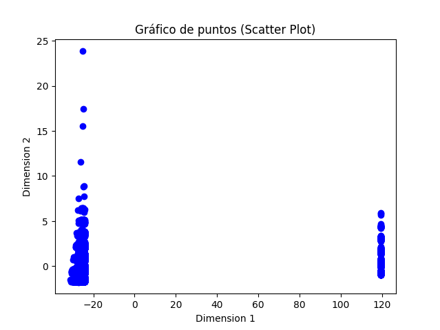
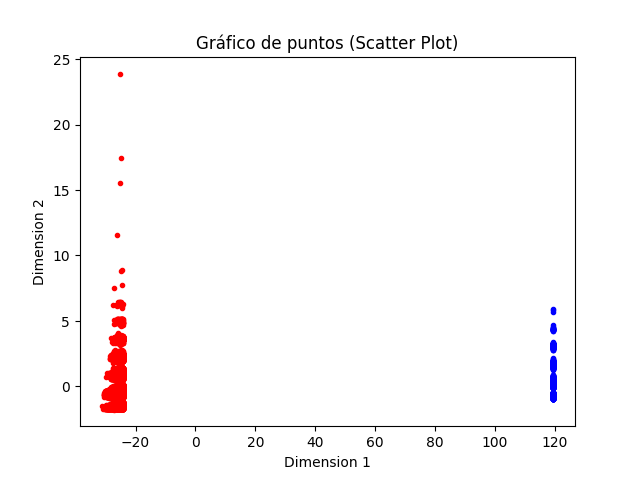

# ROC-AUC

Este sera un proyecto de clasificacion en donde el principal objetivo sera entender la utilidad de las tecnicas de evaluacion de algoritmos de aprendizaje supervisado denominadas como curvas `ROC` y `AUC`.

El [dataset](https://www.kaggle.com/datasets/rikdifos/credit-card-approval-prediction/discussion/119320) a utilizar contiene informacion sobre clientes de tarjetas de credito. La idea basicamente es crear un modelo de aprendizaje supervisado que clasifique en "buenos clientes" y "malos clientes".

Una dificultad de este ejercicio es que, no se incluye un target, por lo tanto, se deben utilizar estrategias de aprendizaje no supervisado para generarlas.


## Preprocesamiento

Shape del dataset: `(438557, 18)`

Columnas del dataset:
```
ID
CODE_GENDER
FLAG_OWN_CAR
FLAG_OWN_REALTY
CNT_CHILDREN
AMT_INCOME_TOTAL
NAME_INCOME_TYPE
NAME_EDUCATION_TYPE
NAME_FAMILY_STATUS
NAME_HOUSING_TYPE
DAYS_BIRTH
DAYS_EMPLOYED
FLAG_MOBIL
FLAG_WORK_PHONE
FLAG_PHONE
FLAG_EMAIL
OCCUPATION_TYPE
CNT_FAM_MEMBERS
```


0- Duplicados: si se elimina la columna `ID`, el dataset presenta 348.472 elementos duplicados (79.45%).


1- Manejo de nans: la unica columna con valores nan es `OCCUPATION_TYPE`.

Contiene 134.203 valores Nan (30.6%), se eliminara la columna.

2- Codificacion: 8 de 18 columnas son categoricas ...

La siguiente lista es el conjunto de variables categoricas con sus categorias.

```
CODE_GENDER : 2
FLAG_OWN_CAR : 2
FLAG_OWN_REALTY : 2
NAME_INCOME_TYPE : 5
NAME_EDUCATION_TYPE : 5
NAME_FAMILY_STATUS : 5
NAME_HOUSING_TYPE : 6

```

Con lo anterior, utilizando `OneHotEncoding`, quedaria en un total de 37 columnas (17 - 7 + 27), una cantidad complemente viable.

3- Scalers: se utilizara `RobustScaler` antes de `PCA`

4- Extraccion y seleccion de caracteristicas: se utilizara PCA para lidiar con graficacion de datos.

5- Outliers: se compararan los resultados graficos identificando casos anomalos.

6- Desequilibrio de datos: se estudiara despues de generar las etiquetas.

7- Estudio de distribucion gaussiana de los datos: no se realizara.

8- Correlaciones: no se realizara.

## Generacion de etiquetas

Despues de ejecutar los pasos de preprocesamiento 1-4 (minimos para poder graficar) obtenemos los siguientes resultados.



Despues de utilizar `K-MEANS` para la generacion de etiquetas, obtuvimos el siguiente resultado.



## Entrenamiento

## Evaluacion
